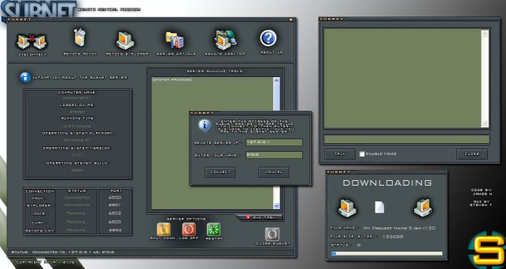



## RemAdmin

### Description

This is a "spin-off" of my original Remote Admin program. There were several comments about a better GUI, so this is what I've come up with. The program is about 80% completed right now and I plan on adding more features. The "remote explorer" on the client can recognize over 80 different file types to add easy in viewing the remote computer's files. If you find any bugs, please alert me about it. If you'd like to see this program completed, show me some votes and comments. Thanks in advance, James
 
### More Info
 

             |
---                |---
**Submitted On**   |2005-01-03 19:09:56
**By**             |[AJ Trahan](https://github.com/Planet-Source-Code/PSCIndex/blob/master/ByAuthor/aj-trahan.md)
**Level**          |Advanced
**User Rating**    |5.0 (194 globes from 39 users)
**Compatibility**  |VB 6\.0
**Category**       |[Complete Applications](https://github.com/Planet-Source-Code/PSCIndex/blob/master/ByCategory/complete-applications__1-27.md)
**World**          |[Visual Basic](https://github.com/Planet-Source-Code/PSCIndex/blob/master/ByWorld/visual-basic.md)
**Archive File**   |[RemAdmin183640132005\.zip](https://github.com/Planet-Source-Code/aj-trahan-remadmin__1-57433/archive/master.zip)

